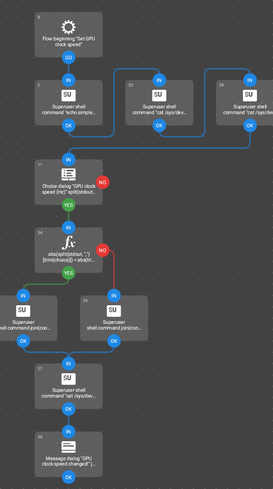
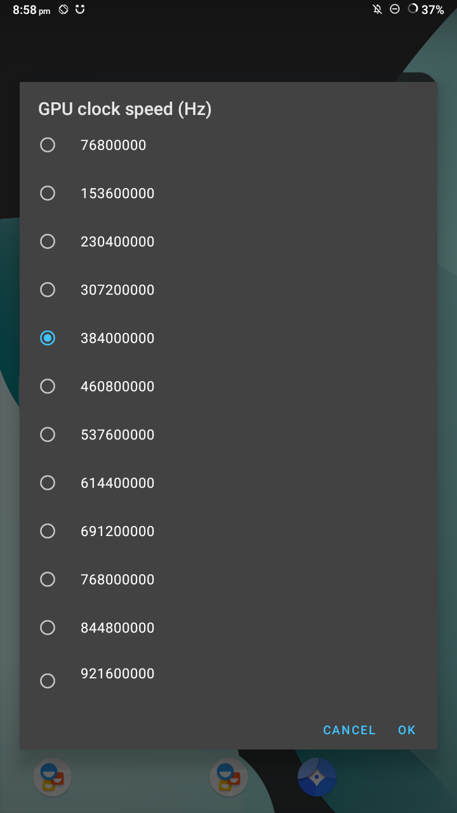
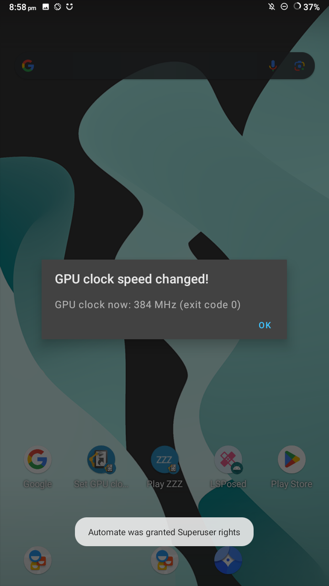

# NX-Switchroot-SetGPUclock
["Automate"](https://play.google.com/store/apps/details?id=com.llamalab.automate&hl=en) flow app for setting the GPU clock speed on Switchroot

## Flow preview

## Screenshots

